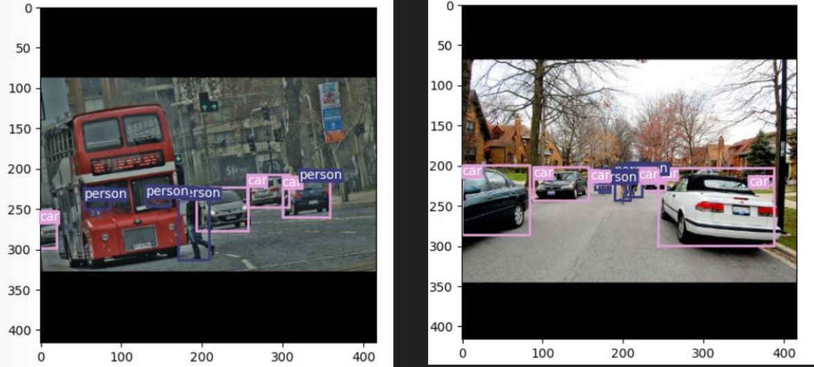
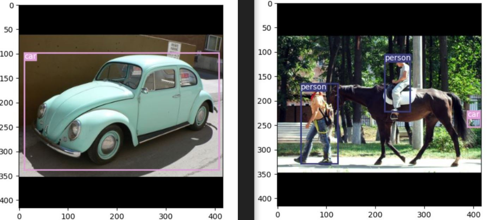

# Group 43: Object Detection with YOLOv3 

Pascal VOC dataset: 
https://www.kaggle.com/aladdinpersson/pascal-voc-dataset-used-in-yolov3-video

COCO dataset: 
https://www.kaggle.com/dataset/79abcc2659dc745fddfba1864438afb2fac3fabaa5f37daa8a51e36466db101e

## Discription

This project served as an opportunity to gain familiarity with Deep Neural Networks (DNN) and their implementation. A common yet significant problem is object detection and classification, as such, YOLO (You Only Look Once) was chosen for implementation due to its popularity in real-time applications such as autonomous driving. Furthermore, datasets are crucial components of neural networks and accordingly, we chose to work with Pascal VOC and COCO datasets, these being commonly used in image classification and detection scenarios. Moreover, to keep the problem manageable, the network was only trained on two classes (People and Cars) and a subset of images. The network was implemented using PyTorch and trained on GPU using Google Colab and GCP.

 

To make for an inquisitive project, an emphasis was placed on understanding the intricacies such as the effect of each dataset on the result, the size of dataset as well as the type of objects being detected and classified. In particular, a comparison was made on how the network performed on small and large objects in the image.

 

#### Results From Network Trained on COCO Dataset

#### Results From Network Trained on VOC Dataset

[Project Report](Object%20detection%20with%20YOLOv3_Group_43.pdf)
